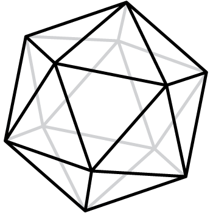

# Generative Organic Forms

This project aims to model an evolving system of cells that undergo mitosis and react with a variety of systemic and external forces. Implemented in Processing, it currently outputs a 3D mesh (.OBJ) of the particle system's state upon keypress. Inspiration for this project was drawn from [Digital Morphologies: Environmentally-Influenced Generative Forms](https://drive.google.com/file/d/0B_4X5OQcV3d8Y3JYWFBpU1ZWbHM/view) by Sage Jenson. 

## Initial State
The organic forms begin as collections of 20 [particles](particle.pde), each with a position **p** and normal **n** in **R^3**, along with a set of linked particles **L**. They are arranged into an [icosahedral mesh](icosahedron.pde) with the particles as vertices and links as edges. 

## Forces

Each particle's position is [updated](generate.pde) at every timestep. The following four forces are calculated for each particle, multipled by scalers, and added together to inform the particle's new position.

### Spring
The spring force acts as a linear spring aiming to maintain a fixed distance **S**
between linked particles. The displacement due to the spring force is
calculated as the average of these linear springs.

### Planar
The planar force pushes the particle towards the average position of its linked
neighbors, encouraging the mesh to return to a locally planar state.

### Bulge 
The bulge force pushes the particle out in the direction of the normal when linked
particles are closer than **S**, the link length. The magnitude of the bulge force is
how far, on average, the particle would have to move along the normal to allow the links to
return to an uncompressed state. For each linked particle i ∈ **L**, let **θ** be defined
as the angle between points **p**, **p_i**, and **t**; where **t** is the point **S** distance away from **p_i**
along **n**.

### Collision
The collision force repels physically close particles to avoid intersection, acting on
pairs of unlinked particles that are closer than a fixed radius **R**. The magnitude of
the force is proportional to the average of the inverse square of the distance. Define **C** to be the collection of 
particles not linked to the current particle, yet closer than **R** to the current particle.

## Mitosis

Each particle contains an internal nutrient level. It begins set to 0, and is incremented by 1 at each timestep. 
Once a particle's nutrient level reaches a set threshold, it will split along the shortest axis of diametrically opposed particles in **L**. A new particle is added to the system and both the parent and child particle's nutrient levels are reset to 0.

## Parameters

The search space for ideal growth is huge since there are so many parameters. I will include the parameters used to create the following GIF, but many more patterns are possible. I encourage you to play around with **c1** - **c4** especially.

**S**(=1.1): the "resting" distance between particles. The spring force aims to keep all particles this distance from each other.

**R**(=10): the minimum collision distance. The collision force acts on all unlinked particles within this distance from each other.

**c1**(=0.1): the scalar to determine the strength of the *spring* force.

**c2**(=0.005): the scalar to determine the strength of the *planar* force.

**c3**(=0.01): the scalar to determine the strength of the *bulge* force.

**c4**(=0.1): the scalar to determine the strength of the *collision* force.

**threshold**(=20): the minimum nutrient level of a particle before the chance of splitting.

**splitProb**(=0.03): the probability that a particle over the nutrient threshold will split at each timestep.

## Sample Result:

